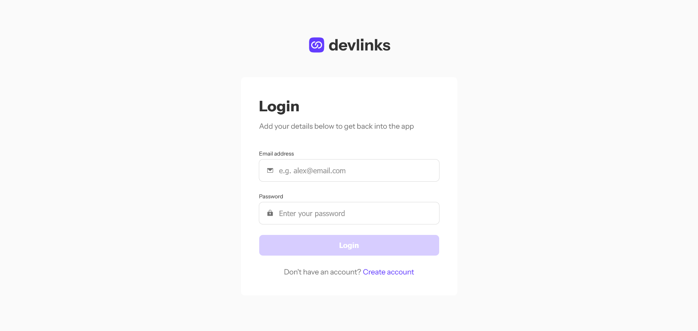

# Frontend Mentor - Link-sharing app solution

This is a solution to the [Link-sharing app challenge on Frontend Mentor](https://www.frontendmentor.io/challenges/linksharing-app-Fbt7yweGsT). Frontend Mentor challenges help you improve your coding skills by building realistic projects. 

## Table of contents

- [Overview](#overview)
  - [The challenge](#the-challenge)
  - [Screenshot](#screenshot)
  - [Links](#links)
- [My process](#my-process)
  - [Built with](#built-with)
  - [Useful resources](#useful-resources)
- [Author](#author)

## Overview

### The challenge

Users should be able to:

- Create, read, update, delete links and see previews in the mobile mockup
- Receive validations if the links form is submitted without a URL or with the wrong URL pattern for the platform
- Drag and drop links to reorder them
- Add profile details like profile picture, first name, last name, and email
- Receive validations if the profile details form is saved with no first or last name
- Preview their devlinks profile and copy the link to their clipboard
- View the optimal layout for the interface depending on their device's screen size
- See hover and focus states for all interactive elements on the page
- **Bonus**: Save details to a database (build the project as a full-stack app)
- **Bonus**: Create an account and log in (add user authentication to the full-stack app)

### Screenshot

### Links

- Solution URL: [https://www.frontendmentor.io/solutions/link-sharing-reactredux-deqlo5jO45]
- Live Site URL: [https://d-sisovic.github.io/Link-sharing/]

## My process

### Built with

- Semantic HTML5 markup
- CSS custom properties
- Flexbox
- Mobile-first workflow
- [React](https://reactjs.org/) - JS library
- [Firebase](https://firebase.google.com/) - For BE API calls
- [@hello-pangea/dnd](https://www.npmjs.com/package/@hello-pangea/dnd) - npm library
- [react-redux](https://www.npmjs.com/package/react-redux) - For managing state/npm library
- [react-hook-form](https://www.npmjs.com/package/react-hook-form) - For form state/npm library
- [react-toastify](https://www.npmjs.com/package/react-toastify) - For UI notifications/npm library
- [react-router-dom](https://www.npmjs.com/package/react-router-dom) - For managing router state/npm library

### Useful resources

- [Firebase CRUD](https://softauthor.com/firebase-firestore-add-document-data-using-setdoc/) - This helped me to get into the touch with Firebase v9 API calls.

## Author

Daniel Sisovic
